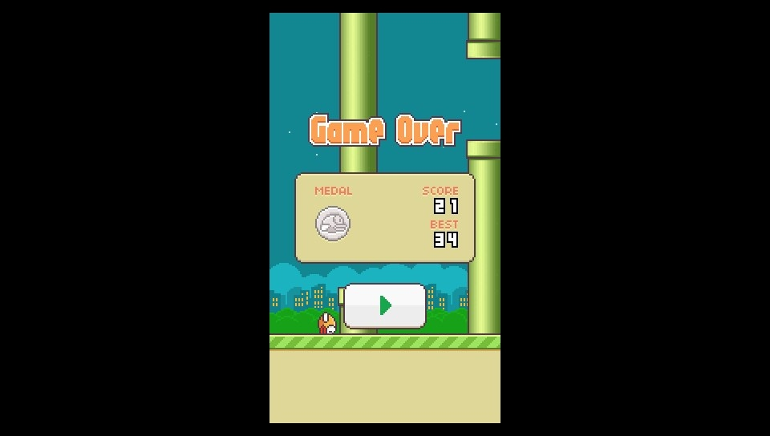
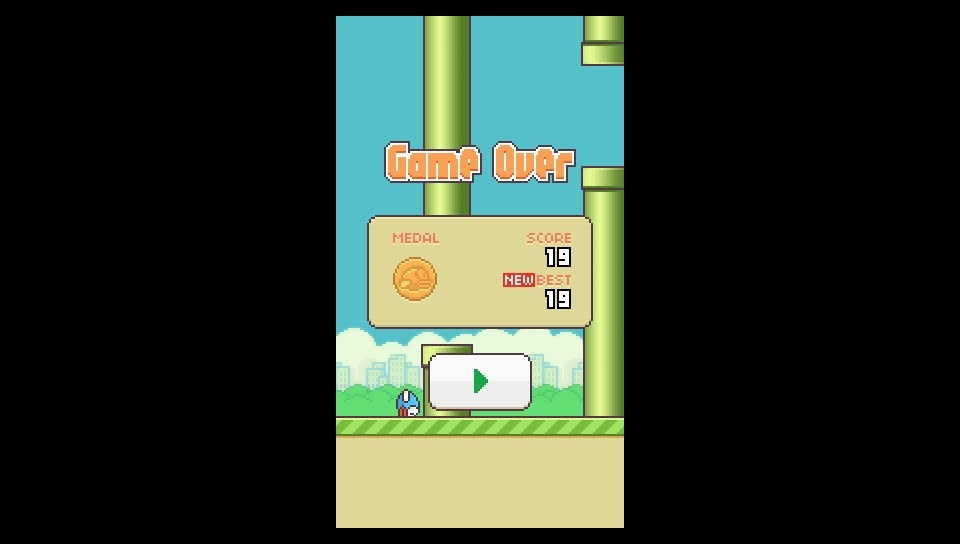

# Flappy-Bird-Classic-vita
Simple flappy bird clone for PS Vita 

## Features:
* Saves
* Nothing else, yes i am dumb
 (you can make sure that I'm dumb by copying the entire description from the previous release, and creating game with assets from original game, waiting for advises for 90 degrees rotation)
## How to play:
* <kbd>Cross or Tap</kbd> - Jump?
## Building
Just build it by typping `cmake .&& make`
### About save
Save file is located in `ux0:data\flappy_bird.save` you can simply edit it 
Here is template : `record` <b>Do not make extra spaces</b> 
Here is example : `2048` score ceil number 
To reset saves just delete *.save file
## Screenshots
 
 
 
 
## Thanks to:
* [xerpi](https://github.com/xerpi/) - [vita2d](https://github.com/xerpi/libvita2d) 
* [VITASDK team](https://github.com/vitasdk) - VitaSDK
